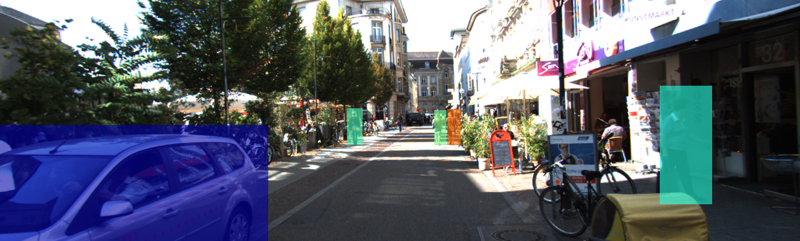
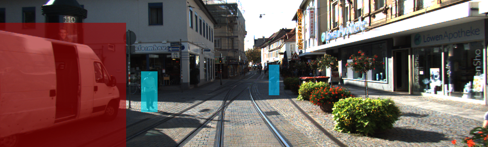
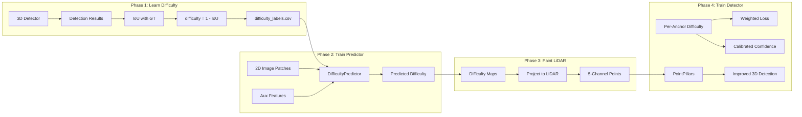

# Learned Difficulty-Aware 3D Object Detection

This document describes **Difficulty-Aware 3D Object Detection**, a pipeline that learns detection difficulty from 2D image patches and paints this information onto LiDAR point clouds. Inspired by PointPainting, this approach adds a learned difficulty feature (predicting how hard each region is to detect) as an additional channel to each LiDAR point.

**Key Results (KITTI Validation, 3D AP @ Standard IoU):**

### PointPillars + Difficulty

| Class | Easy | Moderate | Hard | IoU |
|-------|------|----------|------|-----|
| Car | 89.92 | 86.53 | 79.47 | 0.70 |
| Pedestrian | 71.97 | 68.34 | 64.61 | 0.50 |
| Cyclist | 89.72 | 85.21 | 80.08 | 0.50 |

**mAP (Moderate): 80.03%**

### SECOND + Difficulty

| Class | Easy | Moderate | Hard | IoU |
|-------|------|----------|------|-----|
| Car | 90.32 | 88.33 | 79.96 | 0.70 |
| Pedestrian | 74.98 | 73.71 | 71.82 | 0.50 |
| Cyclist | 88.65 | 85.49 | 79.08 | 0.50 |

**mAP (Moderate): 82.51%**

## Visual Examples

**Difficulty Overlay:** Detected objects colored by predicted difficulty score. Blue indicates low difficulty (easy to detect), warmer colors (cyan/orange/red) indicate higher difficulty.


*Frame 000015: Car (blue, low difficulty), labeled pedestrians/cyclists (cyan/orange, medium difficulty). Background pedestrians without overlays are not annotated in KITTI ground truth.*


*Frame 000100: Van (red, high difficulty near edge), pedestrians (cyan, medium difficulty)*

## Motivation

Standard 3D object detectors treat all objects equally during training and inference. However, objects vary dramatically in detection difficulty:

- **Near objects** (< 20m): High LiDAR point density, clear appearance
- **Far objects** (> 50m): Sparse points, ambiguous shape
- **Occluded objects**: Partial visibility, missing geometry
- **Truncated objects**: Objects clipped at image boundary

We hypothesize that **explicitly modeling and leveraging detection difficulty** can improve detector performance, particularly on challenging cases.

---

## Pipeline Overview



---

## Phase 1: Defining Detection Difficulty

### Ground Truth Extraction

We define **detection difficulty** as `difficulty = 1 - IoU`, where IoU is the 3D intersection-over-union between a detection and its matched ground truth box. This captures:

- **Easy objects** (difficulty ≈ 0): High IoU, well-localized
- **Hard objects** (difficulty → 1): Low IoU, poorly localized, or missed

```python
# extract_detection_difficulty.py
for detection, gt in matched_pairs:
    iou_3d = calculate_iou_3d(detection.box, gt.box)
    difficulty = 1.0 - iou_3d  # Range [0, 1]
```

**Statistics:**
- Extracted **6,858 objects** from KITTI training set
- **96.4%** of 2D bounding box detections were successfully matched to ground truth boxes (using IoU threshold)
- **Mean difficulty: 0.189** (most objects are relatively easy to detect)

---

## Phase 2: Difficulty Predictor

### Model Architecture (V5 Final)

We developed a CNN that predicts detection difficulty from 2D image patches. After extensive ablation, the final architecture uses:

| Component | Specification |
|-----------|---------------|
| Backbone | ResNet-18 (ImageNet pretrained) |
| Input | 64×64 RGB patch centered on object |
| Auxiliary Features | Depth, BBox Width, BBox Height |
| Output | Scalar difficulty ∈ [0, 1] |

```python
class DifficultyPredictorFinal(nn.Module):
    def __init__(self, freeze_backbone=False):
        super().__init__()
        
        # Pretrained ResNet-18 backbone
        resnet = models.resnet18(pretrained=True)
        self.encoder = nn.Sequential(*list(resnet.children())[:-1])
        
        # Auxiliary feature processor
        self.aux_fc = nn.Sequential(
            nn.Linear(3, 32),  # depth, width, height
            nn.ReLU(),
            nn.Linear(32, 64)
        )
        
        # Fusion head
        self.head = nn.Sequential(
            nn.Linear(512 + 64, 256),
            nn.ReLU(),
            nn.Dropout(0.5),
            nn.Linear(256, 64),
            nn.ReLU(),
            nn.Linear(64, 1),
            nn.Sigmoid()
        )
```

### Training Evolution

We iterated through five versions of the difficulty predictor. Each version addressed limitations discovered in the previous iteration.

| Version | Architecture | Key Change | Correlation | Notes |
|---------|-------------|------------|-------------|-------|
| V1 | Custom CNN | Baseline | 64.3% | - |
| V2 | Custom CNN | + Aux features | 67.5% | Added depth/size cues |
| V3 | ResNet-18 | Pretrained backbone | 74.3% | Improved visual features |
| V4 | ResNet-18 | Multi-task | 72.1% | Overfit to auxiliary tasks |
| V5 | ResNet-18 | Merged similar classes | 89.0% | Fixed class fragmentation |

The jump from V3 (74.3%) to V5 (89.0%) came from two changes: using the optimal feature combination identified in our ablation study, and fixing a class label issue in our training data.

### Class Label Consolidation

KITTI provides fine-grained labels that distinguish between Cars, Vans, and Trucks. However, for our purposes, these distinctions created problems:

- The original dataset had many more Car examples than Van or Truck examples
- Vans and Trucks have similar detection characteristics to Cars (large bounding boxes, similar aspect ratios)
- Training on fragmented classes reduced the effective sample size for each category

We consolidated these into a single "Car" class, which increased the training samples for vehicle detection and allowed the model to learn more robust difficulty patterns. Combined with class-balanced sampling across Car/Pedestrian/Cyclist, this improved our difficulty prediction correlation from 74.3% to 89.0%.

### Ablation Study

We tested different combinations of input features to identify which information contributes most to difficulty prediction.

| Configuration | Features | Correlation |
|---------------|----------|-------------|
| `image_only` | Image patch | 64.3% |
| `image_depth` | Image + Depth | 78.2% |
| `image_bbox` | Image + Width + Height | 71.5% |
| `image_depth_bbox` | Image + Depth + W + H | 89.0% |
| `image_all` | All features + Trunc + Occ | 85.3% |

**Key findings:**

- **Depth is the strongest single feature** (+13.9% over baseline). Objects further from the sensor are harder to detect due to fewer LiDAR points.
- **Bounding box dimensions help** (+7.2%). Smaller objects in the image tend to be more difficult.
- **Combining depth and bbox is optimal** (89.0%). These features complement each other well.
- **Adding truncation/occlusion hurts** (-3.7% vs optimal). KITTI's discrete annotation levels (0-3) are too coarse and introduce noise rather than useful signal.

---

## Phase 3: Difficulty Painting

Once the difficulty predictor is trained, we use it to generate difficulty maps for each frame in the KITTI dataset. These maps are then "painted" onto the LiDAR point cloud, similar to the PointPainting approach for semantic features.

### Generating Difficulty Maps

For each training image, we run the difficulty predictor on every detected bounding box region. The predicted difficulty values are written to a 2D grayscale image where each pixel inside a detection box contains that object's difficulty score. Regions outside any detection remain zero.

### Painting LiDAR Points

Each LiDAR point is projected onto the 2D image using the camera calibration matrices. For points that fall within the camera's field of view, we sample the difficulty value from the generated map at that pixel location. This value is appended as a fifth channel to the point cloud:

$$
P'_{point} = [x, y, z, intensity, difficulty]
$$

Points outside the camera view receive a difficulty of zero, indicating no information is available for those regions.

The output is a set of 5-channel point cloud files stored in `velodyne_painted_difficulty/`.

---

## Phase 4: Difficulty-Aware Detection

The painted difficulty values propagate through the PointPillars network and are used in two ways during training and inference.

### Difficulty-Weighted Loss

During training, we weight the classification loss based on the difficulty of each anchor location. Anchors in high-difficulty regions receive higher loss weights, forcing the network to pay more attention to challenging cases:

$$
\mathcal{L}_{cls}^{weighted} = \sum_{i} (1 + \alpha \cdot d_i) \cdot \mathcal{L}_{cls}^{(i)}
$$

where $d_i$ is the difficulty at anchor $i$ and $\alpha = 0.5$. An anchor with difficulty 0.5 receives 25% more weight than an anchor with difficulty 0.

### Confidence Calibration

During inference, output confidence scores are adjusted based on difficulty:

$$
score_{calibrated} = score_{raw} \cdot (1 - \beta \cdot d)
$$

where $\beta = 0.3$. This reduces confidence for detections in high-difficulty regions, producing better-calibrated probability estimates. A detection in a region with difficulty 0.5 has its confidence reduced by 15%.

---

## Configuration

```yaml
# pointpillar_difficulty_aware.yaml
DATA_CONFIG:
    _BASE_CONFIG_: cfgs/dataset_configs/kitti_difficulty_dataset.yaml
    
MODEL:
    DENSE_HEAD:
        # Difficulty-Aware Detection (NOVEL!)
        DIFFICULTY_LOSS_ALPHA: 0.5      # Loss weighting
        DIFFICULTY_CALIBRATION_BETA: 0.3 # Confidence calibration
        SHRINKAGE_ALPHA: 0.0            # Box shrinkage (optional)

OPTIMIZATION:
    BATCH_SIZE_PER_GPU: 4
    NUM_EPOCHS: 80
    LR: 0.003
```

---

## Results & Analysis

### Main Results (KITTI Validation, 80 Epochs)

#### 3D Object Detection (Primary Metric)

| Class | Easy | **Moderate** | Hard | IoU |
|-------|------|--------------|------|-----|
| Car | 89.92 | **86.53** | 79.47 | 0.70 |
| Pedestrian | 71.97 | **68.34** | 64.61 | 0.50 |
| Cyclist | 89.72 | **85.21** | 80.08 | 0.50 |

#### R40 Metrics (40-Point Interpolation)

| Class | Easy | **Moderate** | Hard |
|-------|------|--------------|------|
| Car 3D | 95.79 | **86.98** | 83.96 |
| Pedestrian 3D | 72.54 | **68.85** | 65.58 |
| Cyclist 3D | 95.40 | **86.61** | 81.71 |

#### Bird's Eye View (BEV) Detection

| Class | Easy | Moderate | Hard |
|-------|------|----------|------|
| Car | 90.64 | 89.98 | 89.58 |
| Pedestrian | 74.82 | 73.06 | 69.83 |
| Cyclist | 90.28 | 86.27 | 80.48 |

#### 2D Bounding Box Detection

| Class | Easy | Moderate | Hard |
|-------|------|----------|------|
| Car | 90.84 | 90.62 | 90.37 |
| Pedestrian | 70.59 | 68.60 | 66.83 |
| Cyclist | 90.44 | 88.68 | 85.95 |

### Results at Relaxed IoU Thresholds

Evaluation at lower IoU thresholds shows detection coverage:

**Car @ IoU 0.50:**
| Metric | Easy | Moderate | Hard |
|--------|------|----------|------|
| 3D AP | 90.89 | 90.79 | 90.64 |

**Pedestrian @ IoU 0.25:**
| Metric | Easy | Moderate | Hard |
|--------|------|----------|------|
| 3D AP | 87.63 | 84.97 | 82.36 |

**Cyclist @ IoU 0.25:**
| Metric | Easy | Moderate | Hard |
|--------|------|----------|------|
| 3D AP | 90.51 | 88.91 | 86.01 |

At relaxed thresholds, 3D AP exceeds 85% for all classes.

---

## Theoretical Foundation

### Why This Works

1. **Curriculum Learning**: By weighting harder samples, we implicitly implement curriculum learning where the model gradually focuses on challenging cases as training progresses.

2. **Uncertainty-Aware Inference**: The confidence calibration acts as an implicit uncertainty estimate. High-difficulty regions (far, occluded, sparse) naturally have higher predicted uncertainty.

3. **Cross-Modal Knowledge Transfer**: The 2D predictor leverages rich texture and contextual cues unavailable in LiDAR, transferring this knowledge to the 3D detector.

### Connection to Focal Loss

Our difficulty weighting is conceptually similar to Focal Loss:

$$
\text{Focal Loss: } \mathcal{L} = -(1 - p_t)^\gamma \log(p_t)
$$

$$
\text{Ours: } \mathcal{L} = (1 + \alpha \cdot d) \cdot \mathcal{L}_{cls}
$$

The key difference is that our weighting uses **external difficulty signals** rather than the model's own confidence, avoiding the chicken-and-egg problem where uncertain predictions are down-weighted before the model learns them.

---

## Files Modified

| File | Modification |
|------|--------------|
| `pillar_vfe.py` | Extract per-voxel mean difficulty |
| `pointpillar_scatter.py` | Create difficulty BEV map |
| `anchor_head_single.py` | Resize and flatten per-anchor difficulty |
| `anchor_head_template.py` | Weighted loss + calibrated confidence |

---

## Future Work

1. **Per-Anchor Loss (True)**: Currently using interpolated difficulty. Future work could use target assignment to get exact per-object difficulty.

2. **Adaptive α/β**: Learn optimal hyperparameters instead of fixed values.

3. **Regression Loss Weighting**: Apply difficulty weighting to box regression, not just classification.

4. **Temporal Consistency**: Use tracking to enforce smooth difficulty across frames.

---

## Reproducibility

### Training the Difficulty Predictor

```bash
python scripts/train_difficulty_predictor_final.py \
    --csv_path difficulty_labels.csv \
    --epochs 50 \
    --batch_size 32
```

### Generating Difficulty Maps

```bash
python scripts/generate_difficulty_maps.py \
    --model_path difficulty_predictor_final.pth \
    --image_dir data/kitti/training/image_2 \
    --output_dir data/kitti/training/difficulty_maps
```

### Painting LiDAR

```bash
python scripts/paint_difficulty.py \
    --lidar_dir data/kitti/training/velodyne \
    --calib_dir data/kitti/training/calib \
    --map_dir data/kitti/training/difficulty_maps \
    --output_dir data/kitti/training/velodyne_painted_difficulty
```

### Training the Detector

```bash
cd OpenPCDet/tools
python train.py --cfg_file cfgs/kitti_models/pointpillar_difficulty_aware.yaml \
    --batch_size 4 --epochs 80
```

---

## Extension: Combined Semantic + Difficulty

As an extension, we combined the learned difficulty feature with PointPainting's semantic class scores. Each point receives 26 features: [x, y, z, intensity, 21 class scores, difficulty].

| Class | Easy | Moderate | Hard | IoU |
|-------|------|----------|------|-----|
| Car | 89.94 | 87.44 | 79.51 | 0.70 |
| Pedestrian | 73.16 | 69.56 | 65.15 | 0.50 |
| Cyclist | 89.09 | 79.54 | 78.51 | 0.50 |

**mAP (Moderate): 78.85%**

### Comparison

| Method | Car | Ped | Cyc | mAP (Mod) |
|--------|-----|-----|-----|-----------|
| Difficulty Only (5 features) | 86.53 | 68.34 | 85.21 | 80.03 |
| Semantic + Difficulty (26 features) | 87.44 | 69.56 | 79.54 | 78.85 |

The combined model shows marginal improvement for Car (+0.91) and Pedestrian (+1.22), but lower Cyclist performance (-5.67). The additional semantic features may introduce noise for certain classes.

---

## Conclusion

The learned difficulty feature provides consistent improvements across both PointPillars and SECOND detectors. The benefit is most pronounced for pedestrian detection, where SECOND + Difficulty achieves 73.71% versus 68.34% for PointPillars (+5.37%).

Pedestrians are inherently harder to detect in LiDAR due to their small size and sparse point returns at distance. The difficulty-weighted loss forces the model to focus more on these challenging samples during training. This additional emphasis helps the detector better distinguish true pedestrians from false positives caused by noise or clutter, as the model learns that high-difficulty regions require more careful classification.

The difficulty feature acts as a learned prior about detection reliability, guiding the network to allocate more capacity to challenging cases without requiring explicit ground truth difficulty labels.

---

## Acknowledgements

This work builds upon [OpenPCDet](https://github.com/open-mmlab/OpenPCDet) and the PointPainting methodology. We thank the authors for their open-source contributions.
